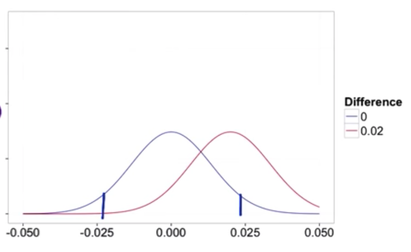

**目录**

[toc]

## AB 测试
流程确定需要测试的变更，到得出结论的整个过程，包括的内容设计任务、选择指标以及分析结果——选择指标、查看统计结果、设计试验以及分析结果。AB 测试的其他方面的应用——包括临床检验。
AB 测试是一个用于在线测试的常规方法，可用来测试产品和功能的更新——示例如：在线购物网络的付费流程变更、。方法是通过设置对照和参照来分析，以确认用户对变更的响应情况。**AB测试的重要作用在于确认变更是否更好，而对完全新的产品或者功能作用不是很大**。
在实际情况下，需要注意用户类型——例如用户对变更的态度。因此在进行测试之前，需要考虑**测试基准**和**测试时间**——以形成稳健的决策，同时需要注意⚠️ AB 测试无法确认忽略的内容。
AB 测试的示例如下：

1. [Google 测试了 41 种不同的蓝色阴影](http://www.nytimes.com/2009/03/01/business/01marissa.html?pagewanted=3)
2. [A/B 测试， 初步决定推出首款推荐的个性化产品，因为该测试表明增加此功能可以带来很大收益](http://www.exp-platform.com/Documents/GuideControlledExperiments.pdf)
3. [测试了是否要将用户信息流的榜首用于显示最新新闻文章或鼓励添加更多联系人的提示](http://engineering.linkedin.com/mobile/mobile-ab-testing-linkedin-how-members-shape-our-apps)
4. [Amazon 页面加载对销量影响](http://www.exp-platform.com/Documents/IEEEComputer2007OnlineExperiments.pdf)
5. [Google 延迟分析](http://googleresearch.blogspot.com/2009/06/speed-matters.html)
6. [可汗学院 ( Khan Academy ) 测试](http://apptimize.com/blog/2014/07/how-khan-academy-uses-ab-testing-to-improve-student-learning/)
	
	>注意避免在 AB 测试过程中发生过早下结论以及前期结论的影响
	
	**[课程实际总结——包括](https://classroom.udacity.com/courses/ud257/lessons/4001558669/concepts/39700990320923)**
	
### AB	测试的特点
不同于临床试验，对用户数据掌握详细，能够有针对性的进行研究。而 AB 测试的数据广泛，对用户端数据了解不详
	
	
## AB测试注意事项	
在进行 AB 测试的过程中需要注意时效性，因为 AB 测试的最重要作用就是体现在及时性反馈。在以下示例中进行 AB 测试时可能存在问题：1）销售车辆的网页变更对销售情况影响——虽然可以通过设置对照和参照，但是可能因为试验**时间太长**，而不能得到及时反馈。2）对品牌信息更新，例如 Logo 设计变化——对于此类变化，是可以**确认肯定会对用户产生影响而不用进行额外的测试**。

### 不使用 AB 测试的解决方案以及对 AB 测试补充

1. 通过查询和观察分析日志，进行假设检验，了解用户行为改变原因，使用其他试验方法来完成随机化和试验，进行前瞻性分析。可以在之后利用 AB 测试来检验假设的正确性
2. 其他方法，例如用户体验研究、焦点小组、调查以及人为评价——可以完成深入的定性数据（AB 测试完成宽泛的定量数据）

## AB测试的应用
使用案例，是更改页面按钮颜色后有多少学生探索了网页。因为是对页面按钮进行的颜色变更，对用户是否会对课程完成的影响，该案例分析中，用户使用页面的流程如下：

而在实际分析的过程中，需要选择合适的方式来进行分析，分析流程如下：

1. 选择合适的测量指标——可以选择指标如下：课程完成量、页面点击量、页面点击率（${click\_through\_rate=\frac{Number\_of\_clicks}{Number\_of\_page\_view}}$）、页面点击概率（${click\_through\_probability=\frac{Unique\_visitors\_who\_click}{Unique\_visitors\_to\_page}}$）。但实际情况下，我们选择页面点击概率来作为本案例的分析指标。选择页面点击概率是基于 1）最终结果是用户完成课程数量；2）使用点击概率说明是分析用户会进行下一步的探索的可能性；3）这样不用去详细考虑因为变更的位置原因的影响。
2. 提出假设——基于变更对用户页面探索的影响，提出了  Initial hypothesis：颜色变更后会增加用户对课程的探索；但是基于对测量指标已经确定，那么可以选择更新假设（Refine hypothesis）——颜色变更后，增加了用户点击概率。
3. 重复试验——基于对结果的检验，数据的可信度，需要对试验进行多次检验。
4. 利用统计学进行分析——提出基于统计学的零和假设和备选假设。此外在使用 AB 测试的过程中假设具有一定特点：

	>此处提出的零假设和对立假设对应于一个双尾检验，可以区分三种情况：

	>* 统计显著阳性结果
	>* 统计显著阴性结果
	>* 无显著统计差异。
	
	>有时候当人们进行 A/B 测试时，他们会使用单尾检验，这只会让你区别两种情况：
	
	>* 统计显著阳性结果
	>* 无统计显著结果
	
	>你应该使用哪一个取决于你将根据结果采取什么措施。 如果你启动实验是为了了解统计显著的阳性变化，仅此而已，则不需要区分阴性结果和无结果，单尾检验就足够了。 如果你想了解差异的方向，则有必要采用双尾检验。

### AB 测试的统计学说明
因为实际过程中 AB 测试是一个双样本试验，因此使用合并方差进行分析，相关公式如下：
${\hat{p}_{pool}=\frac{x_{cont}\ +\ x_{exp}}{N_{cont}\ +\ N_{exp}}}$

>${\hat{p}_{pool}}$ 是合并概率 Pooled probability
>${x}$ 和 ${N}$ 分别对应了试验组、参照组的事件发生值和样本值

${SE_{pool}}=\sqrt{\hat{p}_{pool}\ *\ (1\ -\ \hat{p}_{pool})\ *\ (\frac{1}{N_{cont}}\ +\ \frac{1}{N_{exp}})}$

>${SE_{pool}}$ 表示合并标准差

${\hat{d}\ =\ \hat{p_{exp}}\ -\ \hat{p_{cont}}}$

>${\hat{d}}$ 指试验组和参照组之间的差值

${H_0:\ d\ =\ 0}$

>零和假设试验组和参照组没有差异，并且有正太分布默认条件是 ${\hat{d}}$ ~ ${N(0,\ SE_{pool})}$

${if\ \hat{d}\ >\ z^\ast\ *\ SE_{pool},\ or\ \hat{d}\ <\ -z^\ast\ *\ SE_{pool},\ then\ reject\ H_{0}}$

>拒绝 ${H_{0}}$ 的条件，也就是说试验组和对照组有显著性差异

### AB 测试的实验设计
在开始进行 AB 测试之前，需要进行确认为获取统计学的显著性结果，需要多少的样本；同时还需要，考虑**统计功效**的问题——需要谨记统计功效和统计规模成负相关的关系。

从不同样本量来考虑，大样本会是标准差变小，即分布范围更窄，反而更不利于拒绝零和假设，示例如下：

另一方面，如果样本量过小，又会使试验组和对照组的低差异情况下统计学差异明显，出现（${\beta}$ 值偏高），示例如下：

针对 ${\beta}$ 来说，可以反映敏感性（ sensitivity ），其公式如下： ${sensitivity\ =\ 1\ -\ \beta}$。 一般情况下，为了使试验具有较高敏感型，选择敏感性值为 80%。

在双样本试验的情况下， 大样本对 ${\alpha}$ —— ${P(reject\ null\ |\ null\ true)}$ 无影响，但会降低 ${\beta}$ —— ${P(fail\ reject\ null\ |\ null\ false)}$——从而提高了敏感性。因此合适的样本容量具有重要意义，而样本容量选择可以通过编程语言内建库、通过表格查询以及使用[在线计算器](http://www.evanmiller.org/ab-testing/sample-size.html)（使用工具时请注意以下概念：基准转换率（ baseline conversion rate ）—— 指变更之后的预计点击概率；最低可探测效果（ minimum detectable effect ）—— 指试验的实际显著性要求差异值，相当于 ${\hat{d}_{min}}$ ；最低可探测效果可以选择绝对数值变更和相对数值变更，但是一般选择绝对数值变更）

统计学教材对功效的定义往往将其与敏感性的意义等同，即 1 - ${\beta}$。 然而，它的会话含义通常是指测试得出正确结论的概率，而且这个概率取决于 ${\alpha}$ 和 ${\beta}$。 

**需要注意最低可探测效果 ${\hat{d}_{min}}$是人为给定的，因为它是确认试验中计算得到的${\hat{d}}$ 是否满足了这个最小可探测效果的基准。同时根据${\hat{d}\ \pm\ z^\ast\ *\ SE_{pool}}$ 计算出置信区间，以确认整个置信区间是否满足了 ${\hat{d}_{min}}$**

### 不同置信区间的处理

1. 第一种情况是置信区间完全满足最低可探测效果
2. 第二种情况是跨越了差异为 0 的区间，因此不作为变更合理的依据
3. 第三种情况是低于了最低完全低于最低探测值
4. 第四种情况是既有正面效应又有负面效应，说明对测试的过程或者方式需要改进
5. 第五种是跨越最低探测值，但是又在差异为 0 的位置有值。需要继续测试或者改进测试条件
6. 对最后一种类型的解释——It looks like you decided that to launch a change, the confidence interval should not include zero, and the point estimate (the center of the confidence interval) should be above the practical significance boundary. This makes a lot of sense, but consider the case where your confidence interval includes differences below the practical significance boundary. The true difference is fairly likely to be less than your practical significance boundary, in which case it wouldn't be worth the effort to launch the change. Given this, you would be confident recommending that the change be launched

对于那些不能确定数据可以做出那种决策的类型，一方面因为数据不确定性，以及项目依赖于其他因素——如战略业务等，所以需要进行沟通了解数据之后的内容以及做出判断

## AB测试中的伦理
AB 测试的伦理包括AB测试中的道德规范、如何保护用户。在进行伦理分析的时候，需要从以下几个原则进行分析：风险（ Risk ）、益处（ Benefit ）、选择（ choice ）、隐私（ Privacy ）

1. 风险：试验参与者会承受那些风险

	>主要界限在于风险是否超过了“最低风险”。 最低风险的定义为参与者在日常生活中会遇到的伤害的概率和程度，包括身体、心理、情感、社会和经济方面。 如果风险超过最低风险，那就需要获得知情同意。我们将在后面讨论知情同意。
	>在大多数（并非全部）在线实验中，这些实验是否会导致超过最低风险的伤害是非常有争议的。 如果我们改变某个教育网站的课程排名，或更改某个在线游戏的用户界面，参与者会暴露在什么风险之下呢？与健康或财务相关的网站或应用程序当然除外。 比如，在 Facebook 的实验中，参与者是否真的暴露在超过最低风险的伤害之下是有争议的： 显示的所有内容无论如何都会进入他们的信息流，问题就在于删掉一些文章是否会增加风险。
2. 益处：试验结果可能会产生哪些好处
	>即使风险很小，但是研究结果有什么意义呢？大多数 A/B 测试的益处在于改进产品。 在其他社会科学中，在于理解人的境况以提供帮助，比如教育和发展。医学界的测试风险往往较高，但却能带来健康状况的改善。
	>**能够说明完成研究的益处是非常重要的。**
3. 选择：试验参与者是否还有其他选择
	>要测试一个搜索引擎的变化，参与者始终可以选择使用其他搜索引擎。 主要问题在于参与者的选择越少，强制性以及参与者是否能选择参与与否的问题就越多，以及这些问题如何在风险和益处之间实现平衡。

	>例如，医学临床试验要测试治疗癌症的新药，鉴于大多数参与者面临的另一个主要选择是死亡，那么在知情同意的情况下，参与者的风险还是很高的。

	>对于在线实验，需要考虑的问题是用户可以使用的其他服务有哪些，以及转换服务的成本是多少，包括时间、金钱、信息等。
4. 隐私或数据敏感性：试验参与者期待怎样的隐私保护
	>针对收集到的数据内容，包括隐私和保密性的期望，这包括了以下几个方面的内容：1）参与者是否了解哪些数据被收集了；2）公开这些数据是否会带来伤害；3）参与者是否期望相关数据被当作隐私和保密信息

当然针对现有公共环境中的试验或者数据获取于公共数据，那也就不涉及保密性的问题。另一方面如果由收集了新的数据，那么又需要考虑相关问题：

* 收集了哪些数据？敏感性如何？是否包括财务和健康数据？
* 收集的数据是否会与个人联系起来，也就是说是否具有个人可识别性？
* 数据是如何处理的，采取了什么安全措施？参与者可以期望什么样的保密级别？
* 数据公之于众后会对个人带来什么伤害，包括健康、心理、情绪、社会和财务方面？ 例如很多时候，从观察到的“公共”行为、调查和采访中收集的数据，如果数据没有个人可识别性，则被视为不需要 IRB 审查（参考： NSF 常见问题解答）

总体来说，在进行试验数据采集时，需要注意到以下问题：

* 对于新收集和存储的数据，数据的敏感性如何？处理数据时采取了什么内部防御措施？例如设置了何种访问控制？如何捕捉和管理违反该防御措施的行为等？
* 然后，如何使用收集的数据？如何保护参与者的数据？如何向参与者保证为了此研究而向他们收集的数据不会被用于其他目的？随着数据敏感性的增强，这一点越来越重要。
* 最后，哪些数据会更加广泛地公开，是否会给参与者带来任何额外风险？

大多数研究，由于在线服务的性质，往往风险较小，问题多在于可识别性、隐私、机密/安全性方面的数据收集。 因此，由公司外的中立第三方来做这些决定或许要好过于结果中存在既得利益的人。 在线研究的一个越来越大的风险在于偏见及歧视的可能性，如阶梯计价以及对于特定人群来说这算不算歧视。关于数据收集的内部审核：

* 参与者面临的风险是否降到了最低？
* 参与者了解收集的数据是什么吗？
* 这些数据具有可识别性吗？
* 如何处理数据？

内部审核流程建立：

1. 参与 A/B 测试的每名员工应接受伦理和参与者保护方面的教育。 很明显除了我们谈到的诚信、胜任能力和责任外，还有其他伦理方面，而且往往比保护 A/B 测试的参与者更加广泛（引自美国计算机协会 (ACM) 道德规范)。
2. 所有数据，无论是否具有可识别性，都应安全存储，仅向需要这些数据来完成工作的人提供访问权限，且应该对访问限时。 应针对哪些数据使用是可接受的和不可接受的制定政策。而且，所有数据使用均应记录在案和定期审计，以确保未违反规定。
3. 对于可能存在超过最低风险或数据敏感性问题的处理，应制定明确的上报流程。

### 假名和匿名数据的区别
**可识别的数据**是指使用个人身份信息来存储和收集数据。这可以是姓名、身份证明（例如社会保险号码或驾驶执照号码、电话号码等）。HIPAA 是一种通用标准，这个标准包含了被认为可以被识别的 18 个标识符（[ 参见安全港法 ](http://www.hhs.gov/ocr/privacy/hipaa/understanding/coveredentities/De-identification/guidance.html#standard)）。设备 ID（如智能手机的设备 ID ）在很多情况下被看为个人身份的证明。

**匿名数据**是指在没有任何个人可识别信息的情况下被存储和收集数据。如果数据与随机生成的 ID 一起被存储，例如在某些事件中（如用户第一次访问应用软件或网站并且没有存储此类 ID）时分配的 Cookie，则该数据可以被认为是假名。

在大多数情况下，匿名数据仍然具有*时间戳*，这是 HIPAA 18 个标识符之一。为什么？那么，我们需要区分**匿名的数据**和**匿名化的数据**。 **匿名化的数据** 可以被识别或者匿名数据可以被检查和保证以某种方式重新被识别的风险低到不存在，即给定数据，人们找出这个数据所指的具体个人。通常这种保证是在统计学上进行的，并且考虑多少个人将落入每个可能的桶的可能性（即值的排列组合）。因为存在排列组合的方式，因此这意味着匿名数据仍然具有较高的可能重新被识别的风险。随着敏感性和风险的增加，数据保护的水平必须提高：保密性、控制访问、安全性、监控和审计等。

针对隐私分类以及隐私侵权的说明，参考[“隐私分类法”](https://www.law.upenn.edu/journals/lawreview/articles/volume154/issue3/Solove154U.Pa.L.Rev.477%282006%29.pdf)。

## AB测试测量指标选择
AB 测试的测量指标选择，一般会通过以下几个流程：1）定义指标（ Define ）——可以通过头脑风暴及其他相关方法来确认指标层级及其相关信息。2）建立指标直觉（ Build Intuition ）——确定如何理解指标敏感性和稳健性。3）指标描述（ Characterize ）—— 确认指标相关信息。

需要在明确指标之前，了解用这些指标来做什么，以及怎么样使用指标。对怎么使用指标，可以通过**完整性指标检查**——这一类指标在试验组和对照组中都不会变化，例如通过数据分布检查了解试验组和对照组是否相同，例如用户分布等各方面的信息；另一种方法是**评估**——确认属于高级业务的指标（包括收益、市场份额以及用户数量等），之后时细化指标。

>对于指标概念，通常首先应该是简单明确的阐释指标以使指标能够被容易理解；之后对指标细节进行细化，确定如何明确测量指标；再进一步进行数据测量，确认该指标使用方法。

>对于指标确认还需要注意，对众多指标需要进行相应的评估——因为针对使用目标不同，可能会需要对指标进行调整。当然在团队中的指标使用时，需要注意使用复合指标以避免同一个团队使用不同指标造成的目的分散。复合指标一般被称为目标函数或者 总体评估标准（ OEC 详情见[该文章](http://www.exp-platform.com/Pages/hippo_long.aspx)）。总体来说，对指标选择是一个平衡——需要避免指标过多又要避免任务过于细化；同时在**指标确立过程中需要确认指标是否使用于建立的 AB 测试流程**。下图是新确立的分析流程以及指标确认：

	

>在确认的指标中可能存在困难指标，主要是因为数据难以获取以及数据搜集耗时很长。对于困难指标，可以通过其他方式来进行延伸，具体参考[ Additional Techniques for Brainstorming and Validating Metrics ](https://www.udacity.com/api/nodes/3954679115/supplemental_media/additional-techniquespdf/download)。例如使用外部数据，利用已有数据进行观察分析，调查等。

**在获取到的数据中，需要对数据进行相应的过滤和分隔。因为某些数据是异常原因变化导致的——如竞争对手的恶意行为，信息发布导致的流量异常。因此在对数据进行过滤和分隔是具有重要意义的。**

#### 评估指标分类
1. 汇总数和统计数（ sums and counts ）：用户访问量
2. 平均值、中位数及百分位数（ means 、medians、percentiles ）：课程完成用户平均年龄、页面加载中位数
3. 点击概率和点击率（ probabilities and rates ）
4. 比率（ ratio ）

#### 试验组和对照组数据计算确认
在对初始建立的试验，确立不同指标知识体系时，可以采用简单的计算试验组和对照组之间差异值的绝对变化方式来计算。但是在进行众多试验子后，需要计算相对变化也就是百分比变化。

>**绝对差与相对差**
假如你要通过一个实验测量你的主页的访问量，对照组测量值为 5000 访问量，实验组为 7000。 那绝对差就是它们相减得到的结果，即 2000。而相对差是绝对差除以控制指标，即为 40%。

>**概率中的相对差**
在概率指标中，人们通常使用百分点来表示绝对差，而用百分比表示相对差。 例如，如果你的控制点进概率为 5%，而你的实验点进概率为 7%，那绝对差就是 2 个百分点，而相对差为 40%。 然而，有时候人们会将绝对差表示为 2% 的变化，那么如果有人给你一个百分比，就很有必要让他们说明这个百分比是指相对差还是绝对差！

### 可变性（ variability ）
从统计学角度去分析数据，了解置信区间及其他相关信息进行显著性分析。其他相关方法需要从 AA 测试进行、bootstrap等方式进行实证可变性。
对于二项式分布的参考资料[简单汇总](http://ncss.wpengine.netdna-cdn.com/wp-content/themes/ncss/pdf/Procedures/PASS/Tests_for_Two_Poisson_Means.pdf)，[柏松分布的汇总](http://www.stat.wisc.edu/~wardrop/courses/371chapter9b.pdf)以及[在线计算工具](http://www.evanmiller.org/ab-testing/poisson-means.html)

AA 测试的使用：

1. 可以进行完整性检查——比较期待的结果，如果没了得到期待结果，说明可能计算出错
2. 对指标分布进行假设，但是不能分析估计方差时，如果分布模型符合正态分布，可以通过实证预计方差计算置信区间（ confidence interval empirically），${\hat{d}\ \pm\ z^\ast\ *\ SE_{pool}}$ 
3. 如果不想对数据做任何假设时，可以直接计算实证置信区间——去掉差异值的最大和最小值，其第二大和第二小的值

计算流程可以参考[该表格](https://docs.google.com/spreadsheets/d/17wWNY2jkDlG9BDMYQq2l-ku_8HGajXuF2Zvy__dBEL4/edit?usp=sharing)

实证可变性 —— Bootstraping 方法
当收集随机样本用于 Bootstrapping 算法时，注意要选择“可更换样本”——也就是说可以将同一个组内的一个事件选择两次。  Bootstrapping 算法的运用原理参考[此文](http://stats.stackexchange.com/questions/26088/explaining-to-laypeople-why-bootstrapping-works)。

## AB测试试验设计
1. 选择主体（ choose subject ）决定如何定义试验组和参照组，即要确定把总体中哪些单元选为测试对象。选择的单元即分组单元。
2. 选择总体（ choose population ）需要判断哪些是合格的对象，例如需要分析的是针对某个特定的地区还是全球
3. 试验规模（ size ）需要恰当的试验规模，以确认是否满足试验正确性和变异性要求
4. 试验时长（ duration ）

### 选择主体——引流
针对每次试验时间，不能因为用户刷新页面而导致页面不同。因此一般情况是以每个用户对应某一类的事件，单独针对没个用户又很容易因同一用户都个账户或者不同平台而影响试验的准确性。**所以理解怎么合理安排引流是试验成功的重要点**。

如上，通常使用的引流单位为：

1.	用户 ID（ User ID ）：特点是稳定、不可变；不会因为平台和设备差异出现不同；同时在另一方面，用户 ID 可能会和其他相关信息关联，例如邮箱、电话等相关信息
2. 匿名 ID（ Anonymous ID ）：例如使用 cookie。会因为设备或使用平台等切换，而生成不同的 cookie ；另外用户清除 cookie —— ⚠️**移动设备清除 cookie 相对来说比较困难**
3. 单一事件（ Event ）：根据不同的试验组和对照组来按不同的事件进行区分，导致用户无法获得一致的体验——因此一般是用于不易被用户发现的变更的情况下使用，例如顺序变更。

其他不常使用的引流单位：

1. 设备 ID（ Device ID ）：只用于移动设备，不能被用户变更
2. 基于 IP 地址：易受到因地点变更而导致 IP 变更

针对不同引流单位和不同变化导致的分流是否变化，如下图：

### 引流选择
引流选择的方式，需要参考以下几个条件：

1. 用户一致性 对于需要考虑用户连贯性体验的类型，那么需要考虑使用用户 ID ；如果测试的变更会因为登陆前后发生变化（例如登陆按钮以及导航布局差异），那么可以考虑使用 cookie 。对于两者都是为了针对用户一致性，以及针对用户可见变更——即考虑测量的内容的分流方式。**一般情况下，不使用基于 IP 的分流，因为它没有一致性考虑。但是基于架构类变更、不同主机服务器比较。对不 IP 分流策略，需要注意它对试验组和对照组分类**

2. 引流的伦理考虑 主要涉及对于用户的隐私等问题，具体详情见 AB 测试中的伦理。在引流过程中，如果是针对已有用户的数据采集一般情况下是不涉及伦理问题——因为用户已经在设置过程完成了数据采集选项，且相关内容已经在数据库中。这类主要是针对用户 ID 分流时，可以减少对伦理问题的关注。

3. 差异性 对于实证性差异性（即经验性差异性）高于计算得到的差异性——这是因为分析单元，不同于分组单元。分析单元是指标的分母，例如在点击率中作为分母的页面总量就是分析单元；如果是针对事件的分组单元来看，分组单元的经验性差异性可能会和计算差异性相差较小。**从根本上来看如果分组单元和分析单元，如果两者相同，那么分析差异性和经验差异性的差别最小，示例见下图：**

然而对于分组是通过用户 ID 或者 cookie 的方式，那么点击率指标的两种差异性就能偏大。针对用户 ID 或者 cookie 方式的分组，偏向选择经验性差异性。其本质原因是，在进行计算差异性时，是对数据进行了独立性假设——因此对于事件分类的分组一般是独立的，而基于用户 ID 和 cookie 的分组，独立性假设是无效的，因此导致差异性偏大。详情见[Overlapping Experiment Infrastructure](https://s3.cn-north-1.amazonaws.com.cn/static-documents/nd002/36500.pdf)

### 选择总体
通过非事件分流的试验组和对照组获得数据，都是观察用户的代理（ proxies ）。对于事件分流的数据，需要考虑数据中同一个用户不同分组的情况，例如用户内试验（ intra-user experiment ）—— 例如针对某个功能进行的上线和下线时间内用户的行为（使用时需要注意选择可比性时间段）；交织试验—— 在交织排名实验中，假如您有两个交织排名算法，X 和 Y。算法 X 会依次显示结果 X1、X2、……XN，而算法 Y 会显示 Y1、Y2、……YN。 交织实验会交错显示这些结果，如 X1、Y1、X2、Y2、……并删除重复结果。对此进行测量的一个方法是比较两个算法的结果点进率或概率（主要用于观察）。具体详情见[Large-Scale Validation and Analysis of Interleaved Search Evaluation](http://www.cs.cornell.edu/People/tj/publications/chapelle_etal_12a.pdf)

基本上来说，总体选择主要分为**用户内试验**和**用户间试验**。但是在实际情况中，选择总体时，需要注意以下情况：

1. 确定如何定位客户  例如利用用户浏览器、用户所在地理位置、用户使用语言等。在实际情况中，可能因为试验中存在多种原因的限制用户数量
2. 队列（ cohort ） 将某个类别的总体中按照大约相同的时间等相关信息对用户进行试验组和对照组的用户。因为进行区分较难、另一方面受影响因素较多，因此在稳定性的特征以及希望根据用户历史表现了解变更是否对用户的行为产生重大影响指标的试验中推荐使用队列。队列创建可以有多种方式，例如按国家方式来建立。队列使用具体例子：1）学习效果查询（ learning effects ）；2）用户留存（ user retention ）；3）用户活跃度增加情况（ increase user activity ）

### 试验规模（ size ）
具体示例，见[课程](https://classroom.udacity.com/courses/ud257/lessons/4001558669/concepts/39700990240923)、[减小样本容量示例](https://classroom.udacity.com/courses/ud257/lessons/4001558669/concepts/39700990250923)

### 持续时间（ duration ）
持续时间的选择包括试验时机的选择（返校季、某些特定节假日），试验持续时间，试验持续期间的流量比例控制（因为流量比例的不同影响试验持续时间）。基于流量比例的控制，主要是因为安全性——例如某些功能不能确认是否在所有浏览器中都能运行，以及不能预期新功能是否对用户产生什么样的影响；压力原因——不能确认新功能是否完全上线；还有针对分组不同产生的差异性，可能还有其他因素影响差异性结果；以及展开多个试验任务时或针对相同功能展开的多个试验任务，如针对不同任务设置不同水平参数、相同功能的不同类型的试验，针对这类试验如果想直接对比这些方面，那么可以采取较小比例流量的方式同时展开试验。具体参考[课程](https://classroom.udacity.com/courses/ud257/lessons/4001558669/concepts/39700990290923)，[示例](https://classroom.udacity.com/courses/ud257/lessons/4001558669/concepts/39700990300923)

## AB测试的结果分析
AB 测试的结果分析的流程，一般包括以下内容：

1. 完整性检查（ sanity checks ）

	>其作用是确保试验已经恰当地完成。这是因为试验的各个环节中可能出现错误，导致试验结果无效，例如：试验分配错误——导致试验组和对照组无法进行对比；试验组和对照组设置不同的筛选条件；设置了不同的数据采集功能。为了解决相关的问题，而进行测试以检验试验的完整性。
	
	>完整性检查，主要是针对**不变量指标**进行检查——主要有两种类型的对象进行检查，1）第一种是基于分组单元的总体规模指标，检查试验组和对照组中的总体规模是否具有可比性；2）另一个是实际中不变化的其他指标——不会随着试验进行而发生改变的指标。此类的检查主要是检查在试验前后是否有发生变化。完整性检查中总体规模指标的统计学计算，是假设试验组和对照组中样本是按随机方式（概率 ${p}$ 为 50% ）分配到两群租中。因此总体规模指标的期望概率是 0.5，通过 ${SE}=\sqrt{\frac{p\ *\ (1\ -\ p)}{(N_{cont}\ +\ N_{exp})}}$ 和 ${margin\ =\ SE\ *\ z^{\ast}}$ 来计算出置信区间，以检验试验组和对照组中的概率是否满足置信区间要求。
	
	>**完成以上两种类型的对象完整性检查，才能进入复杂的分析阶段。以及判断试验设计是否合理，并提出可以改进的建议**
	
	>完整性检查，确认是否是某一个时间点数据异常还是整体设置异常。如果发现整体设置异常，处理方案可以采取如下方式：1）技术性问题导致完整性检查没有通过，和工程师沟通，改变策略；2）将总体进行细分，确认是否因为初始设置中国家、语言等原因产生的异常；3）确认选择的主体，在试验组和对照组中是否存在多次出现的异常现象——例如使用 cookie 的主体，通过检查 cookie-age 的方式确认是否在某个组别中存在多个新的 cookie，而另一个组别中存在旧的 cookie。
	
	>>没有通过完整性检查的可能的原因及解决：1）技术性问题，可能工程技术设置的问题。需要和工程技术人员进行沟通；2）数据采集方面的重新进行试验分组——即回顾性分析，以探究问题产生原因；3）试验前和试验后检查，如果试验前和试验中都看见变化，那么问题可能就是出在试验结构和设置方面。如果只是试验中出现了变化，而在试验前未发现变化，那么问题可能就是出现在试验本身；4）数据不匹配的问题，最可能的原因是数据采集过程中出现的问题。
	
	>>完整性检查出现问题，当然可能出现在试验设计、采集数据的时间、试验架构或试验系统等方面的原因导致
	
2. 单指标评估（ single metric ）

	>当使用但指标评估时，利用置信区间的方式来判断**效应值**（ effect size ）是否是统计学显著，其判断依据是置信区间是否包含 0 值，如果不包含那么效应值是统计学显著的，否则为不显著；而使用**符号检验**（ sign test ）来评估统计学是否显著，主要依据的是假设了试验成功的概率是 50% ，同时根据试验是一个二项式分布的试验。以此来计算出符号检验的概率，如果计算出的概率（  ${p_{value}}$ ）小于假设的 ${p_{critical}}$ 值，那么就是统计学显著。
	
	>针对辛普森悖论来说，那么需要从检查设置是否正确以及变更对试验组下的各小组的变化影响不同。可以从以上两个角度分析单指标的影响。
	
3. 多指标评估（ multiple metrics ）

	>在进行计算多指标不会出现假阳性值时，使用的公式是 ${P(FalsePositive=0)\ =\ p_{ConfidenceProbability}\ **\ n}$ （其中 n 是使用的指标数量）。因此在计算至少有一个不会出现假阳性时，是高估了概率——因为多指标评估中计算时是假设各指标没有相关性，但实际中指标之间可能存在相关性。其计算公式是 ${P(FalsePositive \geq 0)\ =\ 1\ -\ P(FalsePositive=0)}$，而且 ${\alpha_{over\_all}\ =\ P(FalsePositive \geq 0)}$
	
	>针对随着指标数量增加, ${\alpha_{over\_all}}$ 也会增加的。解决该问题主要有两种方案，1）尽量保障指标是独立的情况下，可以提高置信概率以减缓随着指标数量增加而导致的 ${\alpha_{over\_all}}$ 增加；2）使用 [Bonferroni 校正](https://en.wikipedia.org/wiki/Bonferroni_correction)（ Bonferroni Correction ），以较保守的方式来保障 ${\alpha}$ 确定的小，而且不需要使用假设。计算独立的 ${\alpha}$ 值，需要通过假设确认 ${\alpha_{over\_all}}$ 的值——例如常规使用的  ${\alpha}$ 值为 5% 来替代  ${\alpha_{over\_all}}$ ,实际计算方式时 ${\alpha_{individual}\ =\ \frac{\alpha_{over\_all}}{n}}$ ，其中 n 为指标数量。使用 Bonferroni correction 的检验和 独立  ${\alpha}$ 检验，针对单个指标分析示例如下：
	
	 
	
	>Bonferroni 校正是一个非常简单的方法，但也有许多其他的方法， 包括[封闭测试程序](http://en.wikipedia.org/wiki/Closed_testing_procedure)、 [Boole-Bonferroni 边界](http://en.wikipedia.org/wiki/Bonferroni_bound) 和 [Holm-Bonferroni 方法](http://en.wikipedia.org/wiki/Holm%E2%80%93Bonferroni_method)。 [此文章](http://en.wikipedia.org/wiki/Multiple_comparisons_problem)包含更多关于多重比较的信息， 而[此文章](http://en.wikipedia.org/wiki/False_discovery_rate)包含更多关于错误发现率 (FDR) 的信息及其控制方法，而不是族系误差率 (FWER) 的控制方法。
4. 分析陷阱（ gotchas ）

## AB 测试伦理问题的扩展阅读
1. [Belmont Report](http://www.hhs.gov/ohrp/policy/belmont.html)
2. [Common Rule definition](http://www.hhs.gov/ohrp/humansubjects/guidance/45cfr46.html#subparta)
3. [NSF guidelines](http://www.nsf.gov/bfa/dias/policy/human.jsp)
4. [NSF FAQ for Social Science & Behavioural research](http://www.nsf.gov/bfa/dias/policy/hsfaqs.jsp#exempt)
5. [HHS IRB Guidebook](http://www.hhs.gov/ohrp/archive/irb/irb_chapter1.htm)
	* [Definition of Minimal Risk](http://www.hhs.gov/ohrp/archive/irb/irb_chapter3.htm)
	* [Discussion of different types of data gathering](http://www.hhs.gov/ohrp/archive/irb/irb_chapter4.htm)
6. [UTexas overview](http://www.utexas.edu/research/rsc/humansubjects/whatis.html)
7. [UC Irvine overview](http://www.research.uci.edu/compliance/human-research-protections/researchers/activities-irb-review.html)
8. [code of ethics](http://www.acm.org/about/code-of-ethics) The Association for Computer Machinery has developed
9. [**“ideal” ethical privacy design**](http://www.oii.ox.ac.uk/research/projects/?id=107) As an example, there’s a thorough outline of an “ideal” ethical privacy design for mobile connectivity measurements that could be used as a model.	

## 参考
1. [参数检验与非参数检验](http://blog.sciencenet.cn/blog-508298-855369.html)

