**目录**

[toc]

# Lesson 1
机器学习并非仅是使用单一算法或者技术去解决问题，而是需要关注针对问题使用算法或者技术的实际，同时怎么样评估学习成果。

# Lesson 2 what is machine learning
人和机器差异——人可以通过过去经历经验进行学习。而机器是通过执行指令完成任务，机器学习的目的就是利用过去的数据以及构造指令完成学习。以下为实际例子：

* 决策树：例如对用户下载信息分析，需要选择合适的 `feature` 来完成数据区分
	
	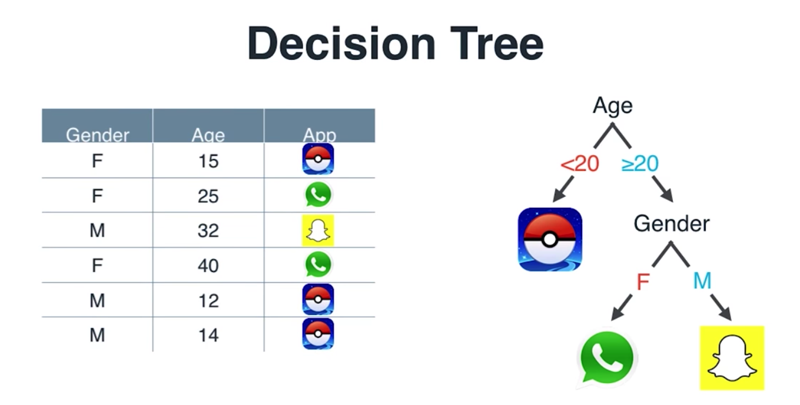
	
	上面的例子就是优先使用 **年龄** 来获得可以完整区分的数据；之后使用 **性别** 来完成最后数据区分

* 朴素贝叶斯：例如垃圾邮件检测，利用贝叶斯概率分析的方式来分析数据中的 `feature`

	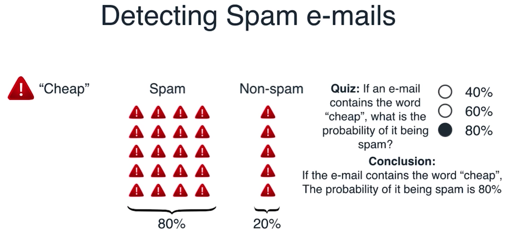

	上面的例子中是使用确认一封邮件中有 `Cheap` 这个单词时，**有多大的概率可以确认为垃圾邮件**。下面的例子是使用更多的 `feature` 来判断一封邮件是否为垃圾邮件
	
	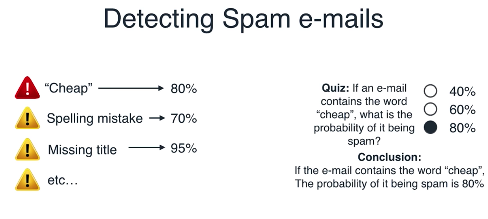
	
* 梯度下降：不断迭代降低误差来解决问题，获得解。可以用于线性回归中——即最小化误差；而在逻辑回归中，**对数损失函数** 即为梯度下降；在支持向量机中，同样可以使用梯度下降的方法来分析

	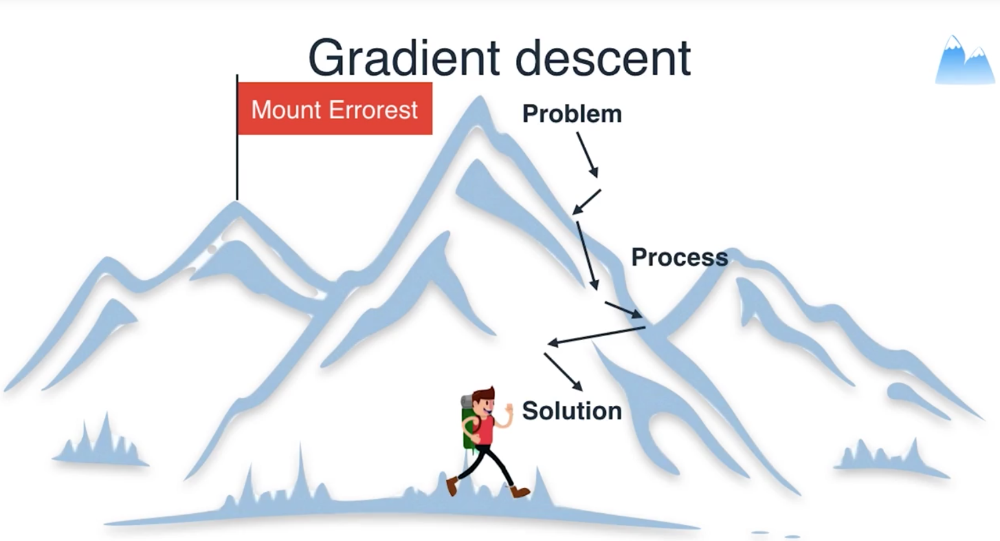

* 线性回归：对数据进行线性拟合，获取一条可以用于预测的 `model`

	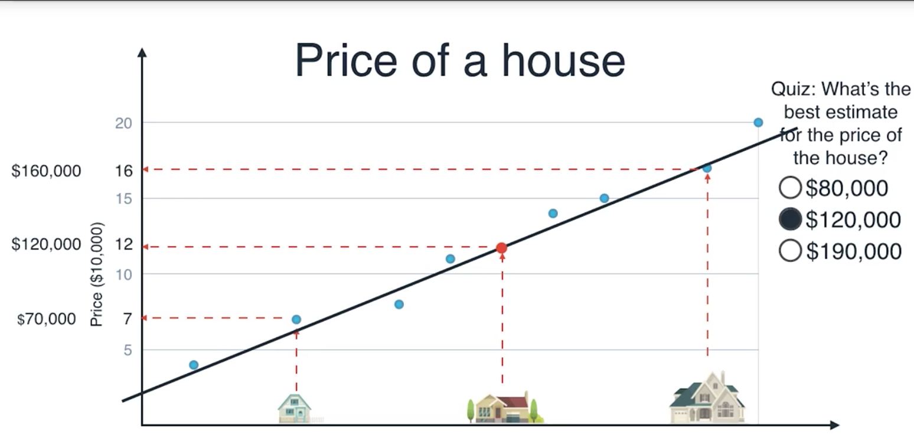

* 逻辑回归：对数据进行分类，需要寻找一条合适的线对数据进行区分，降低被错误区分的数据点数量。而非获得具体的值。需要 **注意** 在实际情况，并非统计的是错误区分的数量，而是使用了对数损失函数（log loss function）——通过对错误归类的点实施大惩罚，而对正确分类点实施小惩罚，分析错差值之和以确认逻辑回归线是否合适。

* 支持向量机：很像一个构造的“机器”空间来区分数据，当这个空间达到最大时即是合适的向量机。实际分析过程中，可以只针对临近“区分线”（更好的说明应该是使用的是边界—— **boundary** ）的点；这里判断合适向量机的依据是——临近点至线的最小距离达到最大，下面图例说明了为什么黄色线条更好

	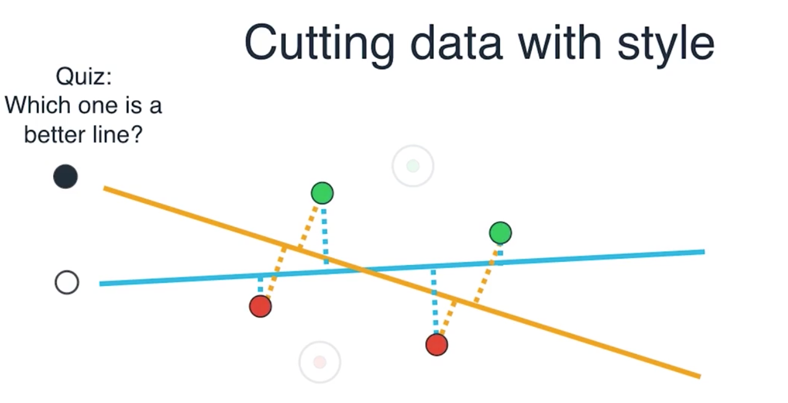

	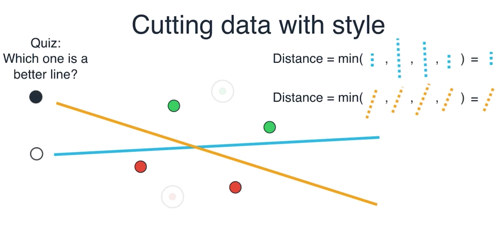

* 神经网络：对于某些用单一特征无法区分的数据，需要构建多个条件（即特征）进行区分。评估中，使用到的梯度下降方法和逻辑回归中的 **对数损失函数** 相似。实际应用中，构建模型阶段——先利用一个特征直线区分数据，获取到一个是否符合该线条判断依据的值；在利用另一条特征直线来区分数据得到一个是否符合该条线段判断依据的值。对两个线条获得的值空间，进行判断得到了一个完整模型。数据检验阶段——数据点依次在线上进行分析得到一个是否符合依据的数据值，之后进行了一个逻辑和运算。**更合理的解释**，参考[神经网络入门 - 阮一峰的网络日志](http://www.ruanyifeng.com/blog/2017/07/neural-network.html)

	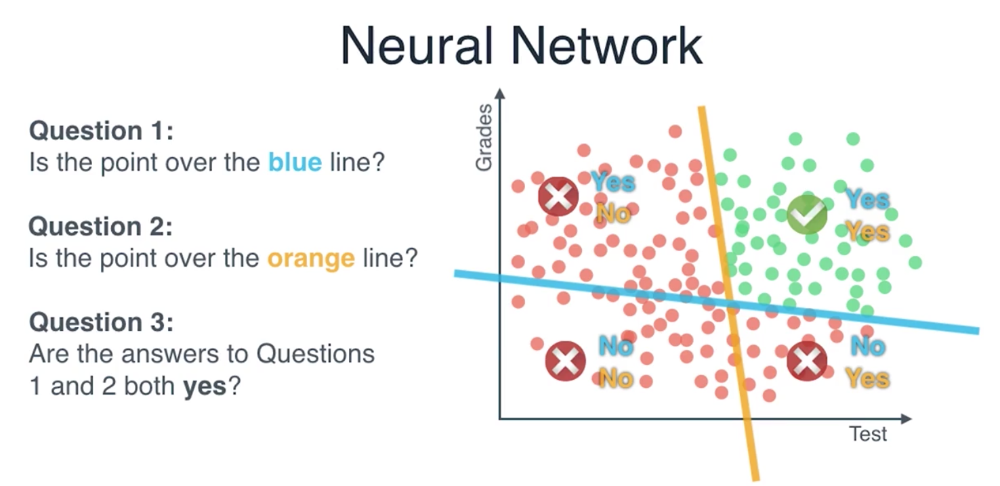
	
	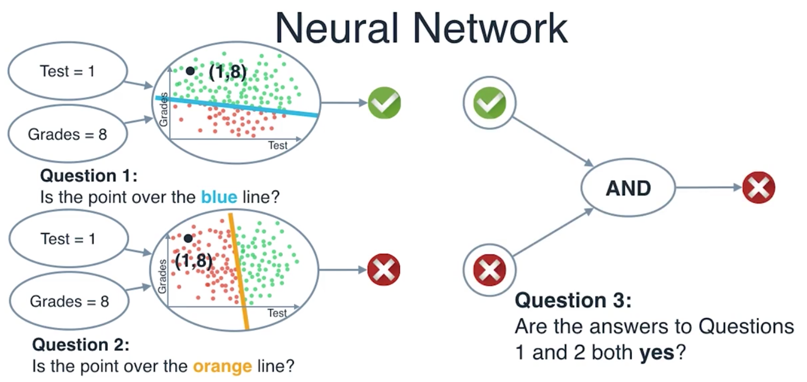

* 核方法：kernel method，核方法的重要作用是线性模型转换，不再单纯以线性方式去区分数据，或者更高维度来说不再单纯以平面来区分数据。在 **支持向量机** 中有很强大作用

	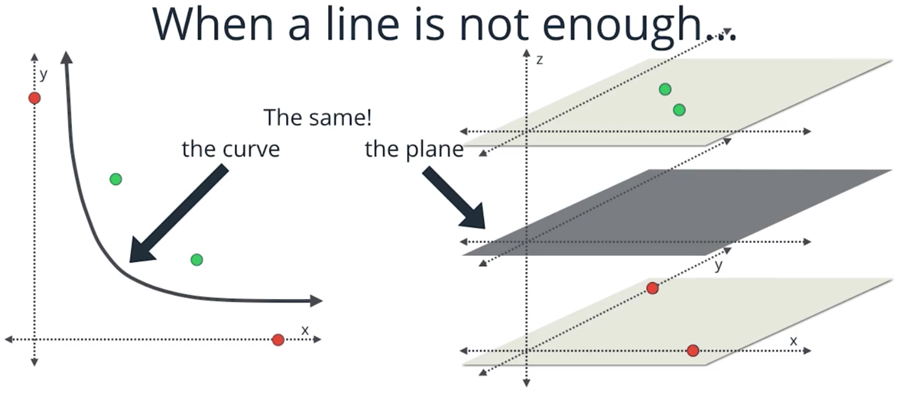
	在下图中，利用高维来解释了使用核方法（本例子中使用的是 `xy`）来构建第三维度，区分数据：
	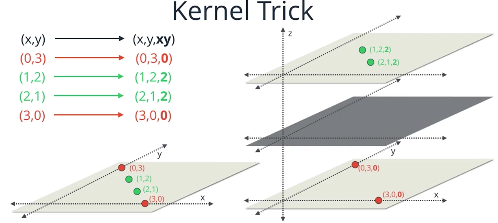

* K 平均值聚类：K-means Clustering，根据需要确认的 `K` 个分类来进行，构建 `K` 个中心点评估数据点和中心点之间的距离关系——不断迭代数据点和数据中心关系

* 分层聚类：Hierarchical Clustering，对于无法直接确认需要分类 `K` 的值或者不需要提前预知的分类 `K` 值，可以采用该方法进行聚类分析。其控制分类数量的条件，是需要设置聚类的类别之间的距离

# 参考
1. [神经网路Neural Networks · 资料科学・机器・人](https://brohrer.mcknote.com/zh-Hant/how_machine_learning_works/how_neural_networks_work.html)

	改文章罗列了LR、DL、NN、BP、CNN、RNN 等模型，其中有相关视频对内容进行说明
	
2. [人工神经网络 - 维基百科，自由的百科全书](https://zh.wikipedia.org/wiki/%E4%BA%BA%E5%B7%A5%E7%A5%9E%E7%BB%8F%E7%BD%91%E7%BB%9C)	
