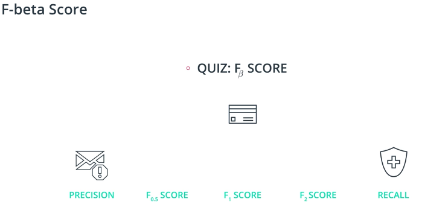
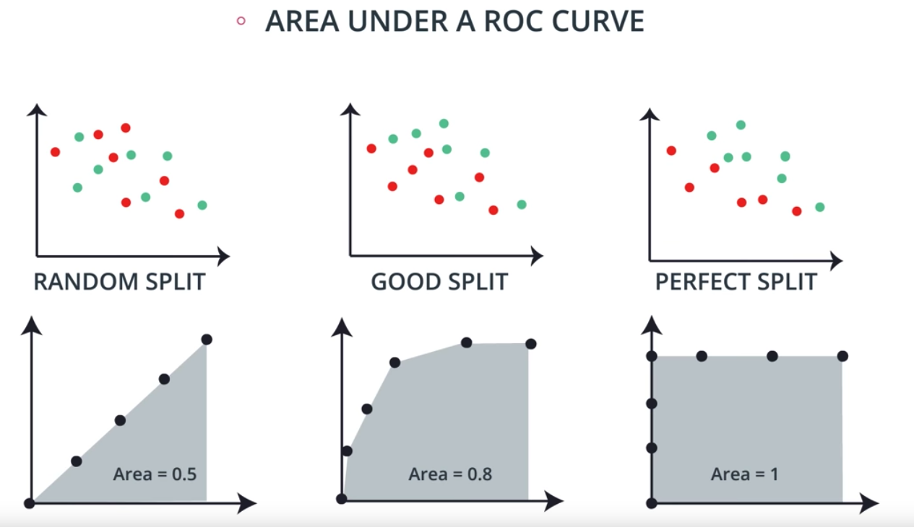

**目录**

[toc]

# 评估指标
测试模型表现请款，选择合适的性能指标的类型，主要取决于尝试解决的问题。**解决问题不同，决定了如何评估模型**

第一个指标，混淆矩阵（Confusion Matrix）—— 根据预测值和实际值构建的矩阵。

* **Type 1 Erro**r (Error of the first kind, or False Positive): In the medical example, this is when we misdiagnose a healthy patient as sick.
* **Type 2 Error** (Error of the second kind, or False Negative): In the medical example, this is when we misdiagnose a sick patient as healthy.

## 分类和回归
**分类** 涉及到根据未见过的样本进行预测，并确定新实例属于哪个类别。例如，可以根据蓝色或红色或者方形或圆形来组织对象，以便在看到新对象时根据其特征来组织对象。

**分类指标** ，是用于预测是否准确地将所讨论的实例进行分类。常用指标：准确率、精确率、召回率和 F 分数

* 准确率：被正确标示的数据点除以所有的数据点。${accuracy=\frac{No.\ of\ items\ labeld\ correctly\ in\ a\ class}{all\ items\ in\ that\ class}}$，即 ${accuracy(\ \ y, \hat{y}\ \ )=\frac{1}{n_{sample}}*\Sigma^{n_{sample}-1}_{i=0}logic(\hat{y}=y_i)}$。单纯使用准确率的缺陷：1）偏斜类数据（skewed classes，数据被过分的分类到某个分类中）的情况下，导致某个部分的数据量过于偏大（导致分类不够准确——分子被正确标记的数量减少），致使准确率偏小；2）针对实际情况下，可能需要遵循不冤枉一个好人的策略——极端案例，把所有数据都标示为好人，那么过分追求准确率可能不是真实需要的结果，可以考虑使用 `precious`；3）另一方面，如果是期望不放过一个坏人的策略——极端案例，把所有数据标示为坏人，那么过分准确率的追求也可能不是真实需要的结果，可以考虑使用 `recall`
* 精确度：`precious`，针对的是确认为 	`Positive` 的对象中，实际真正的 `True Positive` 数量的比例，这类表现为有增大犯第一类错误的可能性。 计算公式为：${precious=\frac{No.\ Positive\ with\ True}{All\ items\ of\ Positive}}$
* 召回率：`recall`，针对的是实际为 `True` 的对象中，实际确认为 `True Positive` 数量的比例，这类表现为有增大犯第二类错误的可能性。计算公式为：${recall=\frac{No.\ Positive\ with\ True}{All\ items\ of\ True}}$
* `F1 Score`：这个指标平衡了精确度和召回率，其是精确度和召回率的几何平均数。${F_1=2*\frac{Precious*Recall}{Precious+Recall}}$
* ${F_\beta}$ `Score`：这里的 ${\beta}$ 值可以去 `0.5` 和 `2`，此时对应的 `Score` 为 ${F_{0.5}}$ 和 ${F_{2}}$ ；这是为了更加精细地评价模型。计算公式${F_\beta = (1 + \beta^2) \frac{\text{precision} \times \text{recall}}{\beta^2 \text{precision} + \text{recall}}}$。图列说明 ${F_{0.5}}$ 和 ${F_{2}}$ 如下

	
	
	关于${F_\beta}$ `Score` 的边界说明：
	Note that in the formula for ${F_\beta}$ score, if we set ${\beta=0}$, we get ${F_0 = (1+0^2) \cdot \frac{\text{Precision} \cdot \text{Recall}}{0 \cdot \text{Precision} + \text{Recall}} = \frac{\text{Precision} \cdot \text{Recall}}{\text{Recall}} = \text{Precision}}$. Therefore, the minimum value of ${\beta=0}$, and at this value, we get the precision.

	Now, notice that if N is really large, then ${F_\beta = (1+N^2) \cdot \frac{\text{Precision} \cdot \text{Recall}}{N^2 \cdot \text{Precision} + \text{Recall}} = \frac{\text{Precision} \cdot \text{Recall}}{\frac{N^2}{1+N^2}\text{Precision} + \frac{1}{1+N^2}\text{Recall}}}$. As ${N}$ goes to infinity, we can see that ${\frac{1}{1+N^2}}$.
	Therefore, if we take the limit, we have

	${{\lim_{N\rightarrow \infty}} F_N = \frac{\text{Precision} \cdot \text{Recall}}{1 \cdot \text{Precision} + 0 \cdot \text{Recall}} = \text{Recall}}$.

	Thus, to conclude, the boundaries of beta are between ${0}$ and ${\infty}$

	* If ${\beta = 0}$, then we get **precision**.
	* If ${\beta = \infty}$, then we get **recall**.
	
	For other values of ${\beta}$, if they are close to ${0}$, we get something close to `precision`, if they are large numbers, then we get something close to `recall`, and if ${\beta = 1}$, then we get the **harmonic mean** of precision and recall.

* `ROC Curve`：`Receiver Operating Characteristic`，反应分类数据时不同随机分类中 `True Positive Rate` 和 `False Positive Rate` 之间的关系，图形图下：

	

 
**回归**，根据连续数据来进行预测。例如，我们有包含不同人员的身高、年龄和性别的列表，并想预测他们的体重。或者，像在本课程的最终项目中一样，我们可能有一些房屋数据，并想预测某所住宅的价值

**回归指标**，用于了解模型的预测值与真正值之间差多少。常用指标：平均绝对误差和均方误差

* 平均绝对误差：即 `Mean Absolute Error`，是使用预测值和实际值之间的距离来评估模型。平均绝对误差的计算方法是，将各个样本的绝对误差汇总，然后根据数据点数量求出平均误差。通过将模型的所有绝对值加起来，可以避免因预测值比真实值过高或过低而抵销误差，并能获得用于评估模型的整体误差指标。

* 均方误差：即 `Mean Squared Error`，同样是使用预测值和实际值之间的距离进行计算，不同的是进行了平方化处理。均方误差是另一个经常用于测量模型性能的指标。与绝对误差相比，残差（预测值与真实值的差值）被求平方。对残差求平方的一些好处是，自动将所有误差转换为正数、注重较大的误差而不是较小的误差以及在微积分中是可微的（可让我们找到最小值和最大值）。参考[均方误差](http://scikit-learn.org/stable/modules/generated/sklearn.metrics.mean_squared_error.html#sklearn.metrics.mean_squared_error)

* 回归分数函数：常用 [R2分数](http://scikit-learn.org/stable/modules/generated/sklearn.metrics.r2_score.html#sklearn.metrics.r2_score)，[可释方差分数](http://scikit-learn.org/stable/modules/generated/sklearn.metrics.explained_variance_score.html#sklearn.metrics.explained_variance_score)，通过将构建的模型与最简单的可能模型对比，`R2` 的值范围为 ${[0,\ 1]}$。如果构建模型与最简单模型的误差值相似，那么构建模型比较差，`R2` 值越接近于 ${0}$；反之则越接近 ${1}$

# 参考
1. [sklearn中的模型评估 – d0evi1的博客](http://d0evi1.com/sklearn/model_evaluation/)
